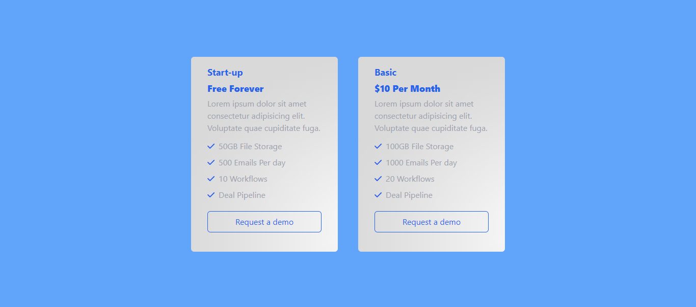

# Tailwind CSS Learning Journey

This repository tracks my progress in learning Tailwind CSS, a utility-first CSS framework for building responsive and modern web designs.

## Day 1: Basic Tailwind

- Learned the fundamentals of Tailwind CSS.
- Explored basic utility classes such as text, background, padding, margin, etc.
  
## Day 2: Tailwind CLI and Advanced Classes

- Familiarized myself with Tailwind CLI for more efficient development.
- Explored advanced utility classes for flexbox, grid, typography, and more.

## Day 3: Responsive Product Card Container

- Implemented a responsive product card container.
- Designed two product cards within the container.
- Added image support to the README to showcase the product card container.

### Technologies Used

- HTML
- CSS (Tailwind CSS)

### Credits

- Tailwind CSS Documentation: [https://tailwindcss.com/docs](https://tailwindcss.com/docs)
- Hitesh Choudhary: [https://youtu.be/MiR1dyW45Uw?si=EJMxPpBzEAmVbLBg](https://youtu.be/MiR1dyW45Uw?si=EJMxPpBzEAmVbLBg)